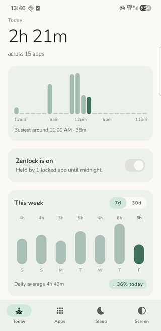
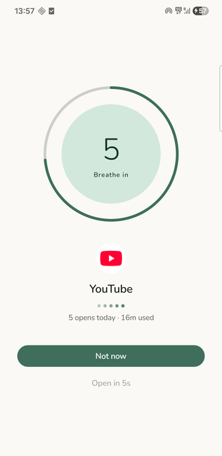
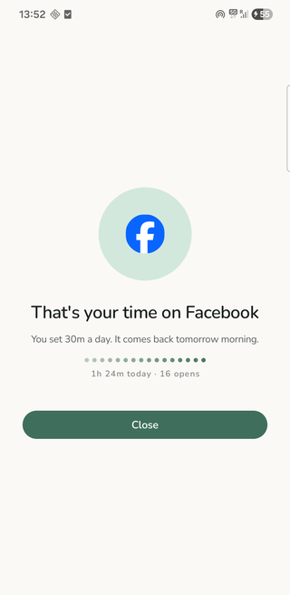
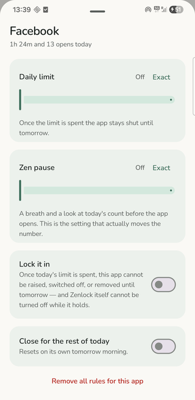
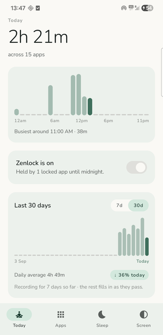

# Zenlock

Android app for cutting screen time. Per-app daily limits, a sleep window that only lets
allowlisted apps open, a timed pause before you can open an app, and a scheduled night filter.

Kotlin, Jetpack Compose, Room. No account, no server, no analytics, no network permission.

| Today | Zen pause | Limit reached |
|---|---|---|
|  |  |  |

| Per-app rules | 30 days |
|---|---|
|  |  |

## Features

**Daily limits.** Set minutes per app. When they run out the app stays shut until tomorrow.

**Zen pause.** A delay before a chosen app opens, with a breathing timer and the number of
times you have opened it today. After the delay you get a five minute pass.

**Sleep mode.** Between two times, everything closes except apps you allowlist. The dialer,
launcher and Settings are always exempt so you cannot lock yourself out.

**Lock.** Opt in per app. Once that app's limit is spent, the rule cannot be raised, switched
off or deleted, and Zenlock's master switch cannot be turned off, until midnight.

**Night filter.** Scheduled amber warmth and dimming. Drawn as an overlay, so it can go darker
than the panel's minimum brightness and needs no WRITE_SETTINGS.

**Stats.** Today broken down by hour, the last 7 or 30 days against your daily average, and the
apps that took the most time.

**Themes.** Five palettes including monochrome, each in light, dark or system.

**Quick Settings tile** for the master switch.

## Build

```bash
./gradlew :app:assembleDebug      # debug APK
./gradlew :app:assembleRelease    # minified, ~1.6 MB
./gradlew test                    # unit tests
```

JDK 17 or newer, Android SDK 35. minSdk 26, targetSdk 35.

## Permissions

All three are granted from Settings screens. Android does not allow an app to request them
in-app.

| Permission | Why |
|---|---|
| Usage access | Read per-app foreground time |
| Accessibility | Detect which app came to the foreground |
| Draw over other apps | Night filter overlay, and launching the block screen from the background |

## How it works

```
ZenAccessibilityService    window changed -> which package?
          |
UsageTracker               how long has it been open today?
          |
BlockEngine.decide()       Allow | Block(reason) | Pause(seconds)
          |
BlockActivity              full screen: hard stop, or breathe then choose
```

`BlockEngine` has no Android imports. It is a pure function over the current state, so the rule
precedence (master switch, sleep allowlist, manual block, daily limit, active pass, pause) is
one readable file and is covered by unit tests without an emulator.

The accessibility service config sets `canRetrieveWindowContent="false"` and the app never calls
`getRootInActiveWindow()`. It only receives the package name of the window that just opened.

### Usage data

Numbers come from `UsageStatsManager` events rather than the app's own bookkeeping, so they
survive the service being killed and match what Digital Wellbeing reports. Sessions are sliced
into hour buckets for the daily chart and day buckets for the history.

Android keeps those events for about a week. For anything longer, `HistoryRepository.sync()`
rolls the retained window into Room as one row per app per day, on every foreground. Today's
rows are rewritten while the day is still moving; past days are frozen. The first week is
inherited from the system, and the rest accumulates from install.

### State

Rules and settings are a single JSON blob in DataStore. `ZenStore` normalises the day on every
read, so a stale `blockedToday` cannot survive into the next morning.

The lock is enforced in `ZenStore.updateRule`, not in the UI. Any edit to a locked rule is
merged through `AppRule.tightenedWith`, which keeps only the changes that make it stricter.
Lowering a limit is allowed, raising it is dropped. No screen can forget to enforce it.

Passes earned by sitting through a pause are held in memory only. If the process dies the pass
is gone and the app asks again.

## Tests

```bash
./gradlew test
```

32 unit tests covering the rule engine, the lock guard and the time maths.

## Font

Bundles [Nunito](https://fonts.google.com/specimen/Nunito), SIL Open Font License 1.1. Full
licence text in `OFL-Nunito.txt`.
